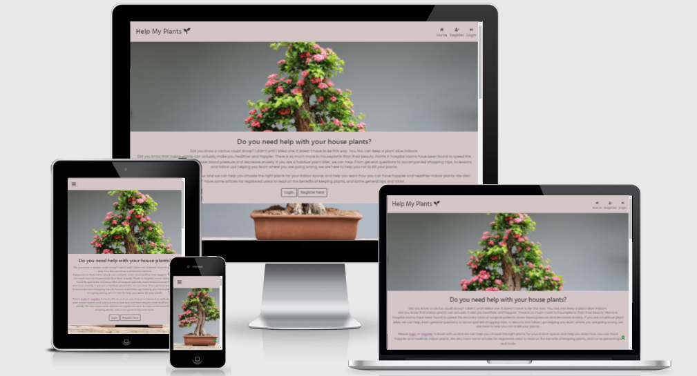
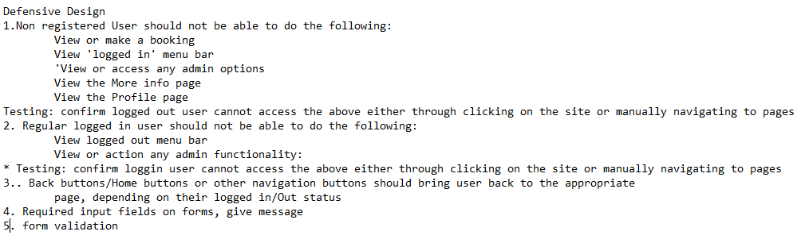

# [Help My Plants](https://help-my-plants.herokuapp.com/)

Help My Plants is a site designed to give users a place to find out how to look after their house plants, and helo choosng the best plants for the space/light in their home/office.
User can learn how to better look after their house plants and find out why they should, by reading articles provided on the site. It will give registered users more information on the benefits of plants and some common things to do to care for their house plants, with links back to the services page where they can book a consulation service relating to the issue. 
The site offers consultation services for registered users to book services. These paid services will consist of personalised one to one advice/guide/lessons on caring for and choosing plants, learning the benefits of keeping plants with follow up consultations available

Site is aiming to encourage people to book consulations and get help on how to not kill their plants!. 

Please use Test Card 4242 4242 4242 4242 expiry:0424 cvc:242 zip: 42424

[Link to live Site](https://help-my-plants.herokuapp.com/)

## **To open any links in a new tab, please press Ctrl + click**

## Table of Contents

- [UX](#ux)
  - [External User Goals](#external-user-goals)
  - [Site Owner Goals](#site-owner-goals)
  - [Strategy and Scope](#strategy-and-scope)
  - [Structure](#structure-of-the-website)
  - [Wireframes](#wireframes)
  - [Surface](#surface)
    - [Colors](#colors)
    - [Typography](#typography)
    - [Images](#images)
	- [DB Schema](#dbschema)
    - [Features](#features)	
- [Technologies](#technologies-used)
- [Testing](#testing)
- [Deployment](#deployment)
    - [SetUp](#set-up)
    - [Heroku Deployment](#steps)
	- [AWS Steps for Set Up](#aws-steps)
    - [Run repo locally](#download-and-run-repo-locally)
    - [Cloning the repo](#cloning-the-repo)
    - [Forking the repo](#forking-the-repo)
- [Credits](#credits)

---

## UX

#### User Stories

| ID    | As as a:        | I want to:                                            | By:                                                                                                                                 |
|-------|-----------------|-------------------------------------------------------|-------------------------------------------------------------------------------------------------------------------------------------|
| US-01 | First time User | Find Out what the site is about                       | Viewing the page and reading information                                                                                            |
| US-02 | First time User | Navigate easily                                       | View accessible parts of the site without to many clicks                                                                            |
| US-03 | First time User | Register, then login to the site                      | Easily enter my registration details, then click to login                                                                           |
| US-04 | Registered User | Login to the site                                     | Easily enter my login details to enter thesite                                                                                      |
| US-05 | Registered User | View Services & Prices                                | Reading the list of available services and being able to view the cost of each                                                      |
| US-06 | Registered User | Choose and book a service                             | Select a service, view the total cost, add my details and click to submit                                                           |
| US-07 | Registered User | Make a payment for the service                        | Easily enter my payment info and complete payment quickly                                                                           |
| US-08 | Registered User | Submit the order                                      | clicking to submit and receiving a confirmation                                                                                     |
| US-09 | Registered User | Navigate easily                                       | Moving around the site with as few clicks as possible, and understand easily how to naviagate to different parts of the site        |
| US-10 | Registered User | View More info                                        | Clicking on a more info item and beng able to read the information                                                                  |
| US-11 | Registered User | View my profile                                       | Clicking on a menu item/icon and seeing my registered details                                                                       |
| US-12 | Registered User | Edit my profile                                       | Clicking on my profile page and updating details                                                                                    |
| US-13 | Registered User | See my previous orders                                | Viewing my profile page and seeing my list of previous orders                                                                       |
| US-14 | Registered User | See my most recent order                              | Viewing my profile page and seeing my active order                                                                                  |
| US-15 | Registered User | Log Out                                               | Clicking on a menu item/icon and easily logging out                                                                                 |
| US-16 | Site Owner      | Provide the functionality for users to Register/Login | Providing a login and registration forms, which are easy for the user to update, and easy to find, through menu option or buttons   |
| US-17 | Site Owner      | Showcase available services & Cost                    | Provide a list of available services with descriptions and cost, that will encourage users to book                                  |
| US-18 | Site Owner      | Allow users to choose & book a service                | Providing an option to select a service and a form to book                                                                          |
| US-19 | Site Owner      | Allow users to pay for the service online             | Providing an easy and secure payment section                                                                                        |
| US-20 | Site Owner      | Give users a confirmation email                       | Giving users a confirmation that their booking was successful and sending an email                                                  |
| US-21 | Site Owner      | Provide more info on what the site is about           | Providing an easy to find page, with content interest to the user, links back to the services page to encourage booking of services |
| US-22 | Site Owner      | Delete content                                        | Easily deleting incorrect/expired content, through easy to use delete options                                                       |
| US-23 | Site Owner      | Edit content                                          | Easily editing content, through easy to use edit options                                                                            |
| US-24 | Site Owner      | Provide the functionality for users to Logout         | Providing a logout form,  which the user can find through through menu option or buttons                                            |

### Strategy and scope

The main goal of the site is to provide user with a site where they can find find out how to "not kill their house plants".
To convert a visitor, and draw them in, there will be a short explanation of qhat they can access on the site. Links to the booking/services page will be provided across the site

  
Strategy and scope plan

  
  

 

### Structure of the website

The basic structure of the site is designed around making it easy for the user to navigate and book services. A user will land on the home page where they can view some high level information and use a simple process to register/login in order to view detailed articles and book services. 

Login, registration, andd logout will also be provided in simple easy to use format. 
Users can read interesting articles about plants, wnd links to booking will be provided on tis page, to encourage booking the services.
Users can view cards with all services which can currently be booked, they will be then taken to a simple checkout page where payment details can be provided.
A profile page will give the user their details. Options will be provided for admin to add new services, and edit or delete currently existing services

#### Structure Plan

 

  
Surface plane plan 

  
  

 

### Wireframes

#### Final Wireframes 

[click here for the final mobile wireframe](README-assets/wireframe-mobile-final.pdf)
 
#### These were the original wireframes

[Mobile](README-assets/wireframe-mobile.pdf)

[Tablet](README-assets/wireframe-tablet.pdf)

[Desktop](README-assets/wireframe-desktop.pdf)

### Surface

#### Includes some design decision made during development

- Footer added day before submission. To give better layout on full content pages. However for logout and empty cart pages, footer is floating up the page.
I have the code to fix the footer, but when this is applied to footer in base template results in footer fixing on top of content in some pages such as articles.
For this project and due to time issues, I have just added some margin on logout and empty cart pages so that footer shows in middle of page and doesn't hug the buttons.
If time allows, will come back to this

- Home page link on mobile nav bar, not on desktop version. Link to home through Icon/branch which is hidden on mobile.

- Decisions relating to time/date field:
	-  My plan was to have a calendar app that user could select availability from, which would be added to order. Couldn't quite figure out how to do this. Then decided
to have a user input field on checkout, which would then be added to order. Ran out of time to get this fully in place, was not getting the date to attach/update on the customers order. Date cannot be updated by user at this time but have added a note and if/else stmt to order history. Wanted to then give Admin access on the front end to amend the "confirmed Date". Page is available but unfortunately I ran out of time to get this full in place. Left page in place for admin but disabled buttons and added a message to admin. Adminuser with access to DB can update at that point.

- I originally planned to have a "one-click" type payment for each product. Due to my knowledge at this time, I decided to change this so that users could book mulitple services(though at this time only one of each type), by adding to cart and procedding to the checkout page.

- I hadn't included quantities on the services. This was designed with the user/customer only wanting to book one service type at a time. A future feature would be that the customer could increase the quantity to book for multiple people on the one booking.

 

  
Surface plane plan

  

 

#### Colors

I used the coolors site to generate a pallette related to plants and nature. These were set as root colours in css and used throughout the site. Where there were
contrast colour issues, I used color picker to change, tryin to keep selected colors in line with site theme.
- Root Colours are: 
 	- main-text-color: #3D4A3D;
	- headers: #343434;
    - color1:#138A36;
    - color2:#D4C5C7

#### Typography

There will be two fonts used throughout the website. The titles font will be Hind, and the accompanying body font will be Poppins. Fallback fonts for both are san-serif
I feel these fonts are easy for user to read on screen and are visually appealing.

#### Images

I used one background image on the home page. Each of the services has an accompanying plant image. 
And there is a small image with each article for visual appeal

#### DB Schema

I have included a rendering of the models, including the all auth ones, created directly from django.

 

  
Click to view 

  

Below is a table of the models/views/templates

| App                                        | Models      | Views                               | Template         | Forms                                                                                                                                            |
|--------------------------------------------|-------------|-------------------------------------|------------------|--------------------------------------------------------------------------------------------------------------------------------------------------|
| services                                   | services    | all_services                        | services         | ServiceForm                                                                                                                                      |
|                                            |             | service_detail                      | service_detail   |                                                                                                                                                  |
|                                            |             | add_service                         | add_service      |                                                                                                                                                  |
|                                            |             | edit_service                        | edit_service     |                                                                                                                                                  |
|                                            |             | delete_service                      |                  |                                                                                                                                                  |
| profiles                                   | UserProfile | UserProfile                         | profile.html     | UserProfileForm                                                                                                                                  |
|                                            |             | order_history                       |                  |                                                                                                                                                  |
|                                            |             |                                     |                  |                                                                                                                                                  |
| articles                                   | article     | all_articles                        | articles.html    |                                                                                                                                                  |
|                                            |             | to get specifc service type details |                  |                                                                                                                                                  |
|                                            |             |                                     |                  |                                                                                                                                                  |
|                                            |             |                                     |                  |                                                                                                                                                  |
| checkout                                   | order       | cache checkout data                 | cart             | OrderForm                                                                                                                                        |
|                                            | orderItem   | view cart                           | Checkout         |                                                                                                                                                  |
|                                            |             | add to cart                         | Checkout Success |                                                                                                                                                  |
|                                            |             | remove frrom cart                   |                  |                                                                                                                                                  |
|                                            |             | checkout                            |                  |                                                                                                                                                  |
|                                            |             | checkout_success                    |                  |                                                                                                                                                  |
|                                            |             |                                     |                  |                                                                                                                                                  |
| Home                                       | None        | Index                               | index.html       |                                                                                                                                                  |
| Bookings                                   | None        | bookings_list                       | Bookings List    | "BookingForm : allow admin to update dates on order.                                                                                             |
| **   Functionality not fully in place yet" |
|                                            |             | update_order                        | update_order     | ** As booking form functionality not yet fully in place, the update order page will render with submit btn disabled and a message to the admin user |

[Back to table of contents](#table-of-contents)

## Features

**_Website has the following_**

### Features which are accessible on all pages with the exception of error pages.

#### Navigation Menu. 

- Contains links to:

| Logged Out | Logged In	|
|------------|-----------------	|
|  Home	     | Services     	|
|  Log In    | More Info	|
|  Register  | Profile 		|
|  	     | Admin *  	| 
				| ** The Admin option is restricted and regular user will not have access
|  	     | Log Out  	|
|  	     |   		|

- Navbar is collapsible icon on medium and small screens, and will display as vertical menu when clicked

#### Footer
Contains some text and links to other pages. Only for logged in user

### Branch/Icon which links back to home Page. 
This is hidden on mobile screens and an option for home is instead displayed in drop down menu

****For logged in users, links to booking services/articles page as featured across the site
****For logged out users, links are displayed at a number of points on the page for user to login/register
### Features on individual pages (In addition to the above)

#### Landing Page

Contains the following:

- Logged Out User 
	- Navigation Menu
	
	- Button to Log in
	- Button to register 
	- Button to click to go to top of page.
	- Footer

#### Registration Page

Contains the following:

- Navigation Menu

- Registration Form with input fields and submit button
	- username
	- password
	- password confirmation
	- email field
	- Submit button to register
	- Link to login page

#### Log In Page

Contains the following:

- Navigation Menu
- Log In Form with 2 input fields and submit button
	- username
	- password
	- Log In button
	- link to registration page

#### Service Page

Contains the following:

- Navigation Menu
- Card groups showing the different services and prices
- Link to More info page
- For Admin/Owner, options available to edit/delete a service

- Individual service. User clicks:
	- Full description
	- Price
	- Add to cart button
- Message will be displayed to user when item successfully added to cart or an info to say item already in cart.

#### Cart 

- Details of items added to cart
- Check/more shopping buttons, top and bottom of pages

#### Checkout Page
- Full order details and Total
- Booking/Payment form
	- user input fields: name, email and phone number		
	- **Prefill some details from profile
	- Payment section
	- Submit Button/Cancel Button 
	- Checkout Success message
- Buttons to view more services/articles

#### More Info/Articles Page

Contains the following:

- Different Text Sections
- Small images for search section
- Links within relevant parts of the text to go to booking/services page

#### Profile Page

Contains the following:

- Profile details section
	Username
	email
	Phone number

-Booking History
	- current fields on display
	- Includes date order was created so user can check most recent order
Btns/links back to book a new service

#### Logout Page

Contains the following:

- Confirm logout button. 

#### Logout confirmation

Contains the following:

- Message to user 

## Future Features

- Full ability for Admin to update dates/times on orders (Functionality for this has been started on the site but not finished due to time constraint)
- Ability for user to select an available date/time slot from site owner provided calendar
- Ability for user to book each service for multiple people. ie using a quantity type input field.
- Ability for Admin to update articles directly on the front end

[Back to table of contents](#table-of-contents)

## Defensive Design 

The following are defensive design elements identified in planning. Each will be manually tested (See testing docs)

 

  
Click 

  

 
		
*** Abuse of Admin privileges, controls on this and info security need to be in place as part of the business process ***

## Technologies Used

- HTML5 - Programming language for structuring the site.
- CSS3- Style sheet programming language
- Python3, Jinja templating language.
- Postgres DB
- pygraphviz with django extensions to render a model direct from DB
- [Github](https://github.com/)- software hosting platform to keep project in a remote location
- [Gitpod](https://gitpod.io/) - a development hosting platform
- Git - used for version-control.
- [Google fonts](https://fonts.google.com/) -used to select and provide typography.
- [Balsamiq](https://balsamiq.com/) - used to build wireframes. Downloaded software to use.
- [Markdown table convert](https://tableconvert.com/) - I am using this to turn data on excel into markdown table syntax
- Microsoft word and excel: to assist in organising planning for project
- Amazon Web services for hosting static files
- [Site for creating DB schema diagrams](dbdiagram.io)
- [Site to enable me to edit pdfS](https://www.ilovepdf.com/) - I needed a tool to allow me to edit pdfs of diagrams 
- [Heroku for deployment](https://heroku.com/)
- Stripe for payments
- gmail for sending emails to users
- temp-email.org
- Secret-key generator
- [Favicon generator - website planet](https://favicon.io/)
- Bootstrap4
- Fontawesome & google fonts
- [ami responsive for mock-ups](ami.responsivedesign.i)
- Validators:
  - jshint
  - validator.w3.org
  - jigsaw.w3.org/css-validator
  - pep8online.com
- [techsini for mock-ups](https://techsini.com/multi-mockup/index.php)
- WAVE extension for reviewing accessibility and colour contrasts in testing.
- Chrome Dev Tools - used to view responsiveness and layout as site was being developed. I found this very useful when developing the site, as it aided my learning throughout the project.
- 

[Back to table of contents](#table-of-contents)

## Testing

[Testing Documentation](https://github.com/LisaHackett97/help-my-plants/blob/main/TESTING.md)

- Issues during development and bugs are covered in this document, in addition to the planned testing.

## Deployment

### Set up:

#### Some requirements
- git
- python3
- pip3 to install packages
- Django:  -->  pip3 install django
- Heroku Account

### Steps 

1. Log into Heroku
2. Create new app name and region
3. Resources tab --> Provision a new Postgres DB
	Add ons : Search for Postgress and selected. Hobby-dev is free
A message should then display on the page, confirming the add-on heroku-postgresql has been installed
4. In Gitpod:
	- install dj database and psycopg2
		- pip3 install dj_database_url
		- pip3 install psycopg2-binary
	- Freeze requirements
		- pip3 freeze > freeze requirements
5. Settings.py
	- import dj_database_url, if not already installed
	
	- DB Settings: comment out the default config
		- Replace the default DB with a call to dj_database_url.parse, and give it the db URL from Heroku
			- (Get from config vars in Heroku or in cmd line, type Heroku config)
- DATABASES = {
    - 'default': dj_database_url.parse('DATA BASE URL from config goes in here')}

***Nb Once migrations and data uploaded, reverft to default settings. You should not push this URL to your remote environment ***
	- Save
		- Note if you need to log into the Heroku cli, use the command:heroku login -i

6. Run migrations  python3 manage.py migrate
7. Import data to the DB:
	- I did not use a fixtures file, so used the following steps:

	- a) ensure connected to the the local SQLite DB
	- b)  Use this command to backup the current database and load it into a db.json file:
		python3 manage.py dumpdata --exclude auth.permission --exclude contenttypes > db.json
	- c) Connect manage.py file to the postgres database
	- d)  Use this command to load the data from the db.json file into postgres:
		- python3 manage.py loaddata db.json

**Before commiting *****Remove DB Url and uncomment the configs in settings so that the DB URL doesn't end up in version ctrl**
**Ensure django default secret key is removed forom settings file**

9. Settings py: 

10. Install gunicorn, freeze requirements, Create Procfile (Ensuring no additional lines in this file)
11. Loginto Heroku on CLI
12. temporarily disable collectstatic
	cli: heroku config:set DISABLE COLLECTSTATIC=1 --app heroku_app_name
(--app flag needed if you have more than one app)

13. Hostname of our heroku app in settings, also add local host so gitpod still works
ALLOWED_HOSTS = ['help-my-plants.herokuapp.com', 'localhost']

14. Ensure the environmental variables are set up in Heroku.
	- Select Settings
	- Select Reveal Config Vars
	- Add the required key values. Click Add after each
	 

	** Note the AWS and stripe variable are put in places, once you set up stripe and AWS on your project
	*** Generate a secret key using an appropriate generator. These key will be different to secret key in gitpod

**Config Variables must be set up before Automatic Deployment is put in place**

16. Set up to auto deploy github/heroku
	Deploy tab: Click gihthub
			Find Repo
			Click Connect
			Enable Automatic deploys
15. Commit and push
	- if not auto connected use this command to push to heroku
	- git push Heroku main
16. - A message should be displayed once the app is successfully deployed
	- Click view to launch app. Static files will not be in place until AWS Set up

### AWS Steps 

AWS S3 for storing static files

1. Create account/Login as root user
https://aws.amazon.com/

2. Access the management console (Through your account if not on screen)
	Find S3 in services
	Open S3 and create a new bucket (Used to store files)
	Name bucket to match heroku app
	Uncheck block all public access
	Acknowledge the bucket will be public
	Click Create bucket
3. Set some basic settings on bucket
	- Properties tab
		- turn on static website hosting
		- Index and error document, fill in some default values
		- Save
	- Permissions tab	
		- Paste the below infto the CORS section Config (sets up the required access btween heroku app and s3 bucket)
			- Click edit to enable you to paste data, and save

		

	- Bucket Policy Tab
		- Select edit, then select policy generator  
			- type will be s3 bucket policy . allow all principals using a *
			- Action will be get object

	- Get the  ARN (Amazon resource name) from the properties tab, and paste it into the ARN Box at bittom
	- Click Add statement
	- Then generate policy
	- Copy the policy (Before you click close) to the bucket policy editor
	- Allow access to all resources in this bucket, add a /* at end of the resource key line  ....help-my-plants/*"/
	- Save Changes

	- Still within Permissions tab, go to Access control List tab. Edit and Under Everyone section, select List
	- Confirm and save

4. configure bucket
	- Access control list tab:
		set list objects permission for everyone under the Public Access section

##### Creating AWS Groups,Policies and Users

5.	Create a user to access the bucket
	- Services Menu, Open AIM
	- Create a grp for our user to live in
	- Create an access policy giving the group access to the bucket we created
		- Assign the user to the group
	a. Create the group. 
		Give it a name such as manage-help-my-plants
		Click create group
	b. Create policy
		Json tab, select import managed policy, search for s3, then import the s3 full access policy
		Get the bucket ARN and paste that into the policy at the resources line, twice. Second will have */ at end, for all files/folders in the bucket
		Click review policy, give it a name and description
		Clock create policy
	c. Attache the policy to the group. Go to the User group, select Add Permissions, Select the policy, click Add
	d. Create a user
		Click add user help-my-plants-staticfiles-user
		Give the user programmatic access
		Select next
		Put user the the group, click through to the end and click create user
- Download the CSV File which has the access and secret access keys.. NB Keep this private but must download at this point

#### CONNECT DJANGO TO S3

- Install  the following if not already in place:
	- boto3
	- django-storages
	- freeze requirements

- add storages to installed apps

- Use following settings for S3

- if 'USE_AWS' in os.environ:
    AWS_STORAGE_BUCKET_NAME = 'xx-xx'
    AWS_S3_REGION_NAME = 'eu-west-1'
    AWS_ACCESS_KEY_ID = os.environ.get('AWS_ACCESS_KEY_ID')
    AWS_SECRET_ACCESS_KEY = os.environ.get('AWS_SECRET_ACCESS_KEY')

- Add AWS config vars to heroku
- set up custom_storages.py file

- Ensure heroku variables are updated with the AWS settings

### To download and run the project locally, follow the below steps:

1. Log into GitHub and lcoate the repository.
2. Select Code
3. Click Download Zip
4. Once files have downloaded, you can extract and use cloned-project locally.

### To Clone, follow the below steps:

1. Log into GitHub and select the repository.
2. Select Code
3. Click https and copy the link
4. Open git bash
5. Change the working directory to where you want the cloned directory
6. Use command git clone and the copied URL
7. Press enter

NB: In order to work with a clone of this project, you may need to download all the DB details, then upload to your own DB
You will also need to install all of the packages listed in the requirements file you can use the following command in the terminal pip install -r requirements.txt which will do it for you.

### Forking the repository:

1. Log into GitHub and select the repository.
2. Select Fork on top right hand corner.
3. A copy should be created in your github profile and pull requests submitted.

GitHub docs link [Forking a repository](https://docs.github.com/en/desktop/contributing-and-collaborating-using-github-desktop/cloning-and-forking-repositories-from-github-desktop#forking-a-repository/)

## Credits

### Media

#### Images Used

- pixabay.com
	- Cactus1  
	- Pink-Orchid
	- Green-plant1#
	- cactus-2
	- aloe-vera-2
	- bonsai-pink
	- bonsai-1
	- No camera image
- Unsplash.com
	- Aloe-vera1  unsplash.com/@laurinscheuber

#### Other

- lorem ipsum generators
		- http://www.cupcakeipsum.com/

- Favicon generated from (https://favicon.io/)

- How to run models image from django on [medium.com](https://medium.com/@yathomasi1/1-using-django-extensions-to-visualize-the-database-diagram-in-django-application-c5fa7e710e16)

### Content

##### Home Page and Articles Page Content
[lifehacker.com](https://lifehacker.com/why-you-keep-killing-your-plants-and-what-to-do-about-i-1778545598)
[rte.ie](https://www.rte.ie/lifestyle/living/2021/1203/1264612-tips-to-keep-your-house-plants-alive-this-winter-and-beyond/)
[tinashomedesigns](https://www.tinashomedesigns.com/inspiration-solutions/design/benefits-of-houseplants)
[gardenersworld](https://www.gardenersworld.com/plants/25-of-the-best-house-plants-to-grow/)
[healthline.com](https://www.healthline.com/health/healthy-home-guide/benefits-of-indoor-plant)

### Colours

- coolor.co to select colours
- color picker to change as needed

### Code

- I reused the code from my MS3 project for the back to top button/icon. This was originally found on https://www.w3schools.com/howto/howto_js_scroll_to_top.asp */
- I followed the Code Institute Boutique Ado walkthrough to guide me through the structure and help me learn what I needed to do.
- Stripe JS Core logic/payment flow comes from ( https://stripe.com/docs/payments/accept-a-payment)
- And CSS from (https://stripe.com/docs/stripe-js)
- Code for back to top taken from B Ado project

### Acknowledgements

I referred to the following to add to my knowledge and for help.

- https://boto3.amazonaws.com/v1/documentation/api/latest/index.html 
- https://lynxbee.com/cloud-technologies/django-and-django-rest-framework/
- https://www.geeksforgeeks.org/django-models/?ref=lbp
- w3docs.com
- https://django-allauth.readthedocs.io/
- stackoverflow
- https://thecodelearners.com/python-django-forms-creating-rendering-validating-and-saving-forms/
- Stripe Docs https://stripe.com/docs/payments/payment-element
- pytutorial.com
- boutique.ado walkthrough projuect
- developer.mozilla.org
- https://lynxbee.com/cloud-technologies/django-and-django-rest-framework/
- https://www.geeksforgeeks.org/django-models/?ref=lbp
- https://www.codacy.com/***
- Code Institute course material, in particular I followed the Boutiqu Ado walkthrough to guide me through the structure
- Slack Community - I searched for a topic and usually someone else had the same question. This has been a great help in developing my understanding.
- Thank you to my mentor Adegbenga Adeye, for his help and guidance.

[Back to table of contents](#table-of-contents)

This site was developed for Educational purposes