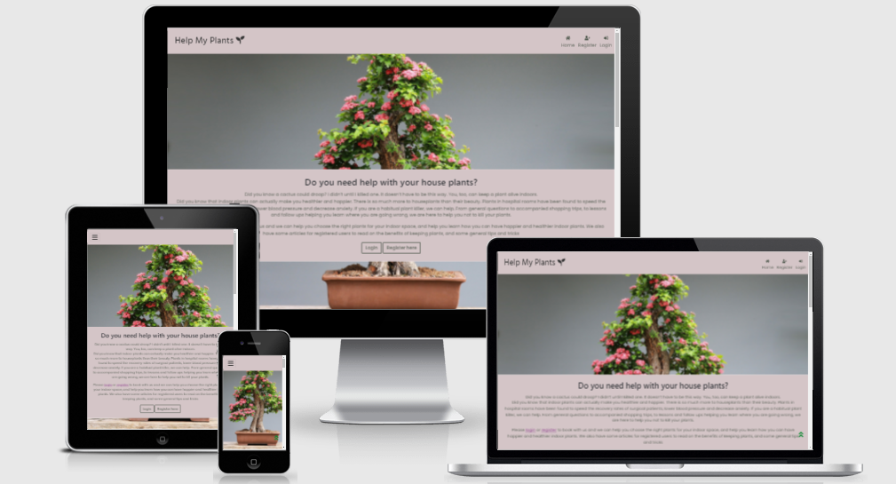
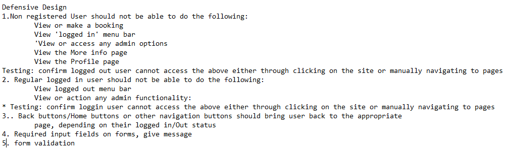

# [Help My Plants](https://help-my-plants.herokuapp.com/)

Please use Test Card 4242 4242 4242 4242 expiry:0424 cvc:242 zip: 42424

[Link to live Site](https://help-my-plants.herokuapp.com/)

This document will cover manual, compatability and validation testing. Issues found during development and bugs are also detailed.
I have included a section on the defensive design elements of the site I planned.

## **To open any links in a new tab, please press Ctrl + click**

## Table of Contents

- [Testing](#testing)
  - [Planning Approach](#testing-plan)
  - [Defensive Design](#Defensive-design)
  - [Functionality testing](#functionality-testing)
  - [Compatibility testing](#compatibility-testing)
  - [User stories testing](#user-stories-testing)
  - [Issues found during site development](#issues-during-development)
  - [Bugs](#bugs)
  - [Performance and Accessibility testing](#performance-and-accessibility-testing)
  - [Code Validation](#code-validation)
  - [Main README File]
    
---

### Testing Plan

Testing Plan:

For each change/bug resolved, test the feature to ensure working as expected. Test other developed features to ensure no changes

Once main development finished, the following testing should be done.

#### Manual testing will cover the following
  
- Run Functionality/feature tests
- Each feature is tested per plan. Feature, expectation, testing and results are noted.
- Negative and positive cases to be tested
- Tests to be run for each feature on the site. Each will be tested for 3 user types. Logged-out/logged-in/admin.
- If a bug is encountered, work is done to resolve. Noted in bugs section. And testing cycle to start at beginning.
- Check responsiveness for screen sizes
- Do the user story testing. Review each goal of users. Note how this is achieved. Issues noted
- Review already resolved bugs and test again.

#### Non-manual testing

Run code through

- validators
- lighthouse
- WAVE extension

Validation of code re-checked each time a change made, after the main development completed.  
If issues occur, resolve and re-run validation tests.  
Wave tests help identify issues early so that they could be corrected and feature/functions re-tested.

- Validate css, html and javascript.
- Lighthouse reports
- WAVE accessibility reports
- Cross brower testing

[Back to table of contents](#table-of-contents)

### django testing TBC

#### Defensive Design

The following are defensive design elements identified in planning. Each has been manually tested as workings as expected

The following are defensive design elements identified in planning. Each will be manually tested (See testing docs)

 

  
Click 

  

 

[Back to table of contents](#table-of-contents)

### Functionality Testing

| Feature:                                                                                                                                                                                                     |  Nav Bar                                                                                                                                              |
|--------------------------------------------------------------------------------------------------------------------------------------------------------------------------------------------------------------|-------------------------------------------------------------------------------------------------------------------------------------------------------|
| Expected:                                                                                                                                                                                                    | " Users can view and access menu items according to their user status.                                                                                |
| Logged out can view Home/Registration/Login. Logged in can view services, more info, profile and logout.                                                                                                     |
| On smaller Screens, burger menu on screen                                                                                                                                                                    |
| "                                                                                                                                                                                                            |
| Testing:                                                                                                                                                                                                     | View nav menu as each type of user. (in small and large screen sizes) Click on each link. Manually try to navigate to each page                       |
| Results:                                                                                                                                                                                                     |                                                                                                                                                       |
| Landing Page:                                                                                                                                                                                                | Works as expected                                                                                                                                     |
| Services Page:                                                                                                                                                                                               | Works as expected                                                                                                                                     |
| More Info Page                                                                                                                                                                                               | Works as expected                                                                                                                                     |
| Cart                                                                                                                                                                                                         | Works as expected                                                                                                                                     |
| Checkout Page                                                                                                                                                                                                | Works as expected                                                                                                                                     |
| Profile Page:                                                                                                                                                                                                | Works as expected                                                                                                                                     |
| Admin                                                                                                                                                                                                        | Works as expected                                                                                                                                     |
| Log in/Registration Pages                                                                                                                                                                                    | Home page link had not been added for nav bar. Updated checked and works as expected                                                                                                                                     |
| Log Out page                                                                                                                                                                                                 | Works as expected                                                                                                                                     |
|                                                                                                                                                                                                              |                                                                                                                                                       |
| Feature:                                                                                                                                                                                                     | Footer  (logged in users)                                                                                                                             |
| Expected:                                                                                                                                                                                                    | Logged in users can view footer and content across all pages                                                                                          |
| Testing:                                                                                                                                                                                                     | "View footer on small, medium and large screen sizes.                                                                                                 |
| (Same content for each user type)"                                                                                                                                                                           |
| Results:                                                                                                                                                                                                     | Link text and position not updating fully in deployed. See Bugs section                                                                               |
|                                                                                                                                                                                                              |                                                                                                                                                       |
| Landing Page:                                                                                                                                                                                                | Can view Footer and click on links. This footer not appearing for logged out user, as expected                                                        |
| Services Page:                                                                                                                                                                                               | Can view Footer and click on links                                                                                                                    |
| More Info Page                                                                                                                                                                                               | Can view Footer and click on links                                                                                                                    |
| Cart                                                                                                                                                                                                         | Can view Footer and click on links                                                                                                                    |
| Checkout Page                                                                                                                                                                                                | Can view Footer and click on links                                                                                                                    |
| Profile Page:                                                                                                                                                                                                | Can view Footer and click on links                                                                                                                    |
| Admin                                                                                                                                                                                                        | Can view Footer and click on links                                                                                                                    |
| Log in/Registration Pages                                                                                                                                                                                    | This footer not appearing for logged out user, as expected                                                                                            |
| Log Out page                                                                                                                                                                                                 | Can view Footer and click on links                                                                                                                    |
|                                                                                                                                                                                                              |                                                                                                                                                       |
|                                                                                                                                                                                                              |                                                                                                                                                       |
| Feature:                                                                                                                                                                                                     | Go to top of page button                                                                                                                              |
| Expected:                                                                                                                                                                                                    | For all users, when button clicked, brings user to top of page                                                                                        |
| Testing:                                                                                                                                                                                                     | Click button, to view if user brought to top. Test for all user types                                                                                 |
| Results:                                                                                                                                                                                                     |                                                                                                                                                       |
| All Pages                                                                                                                                                                                                    | Button is no longer bringing user to top of page. Error in console. Review and update to resolve. Code update. Functioning btn in place across most pages. 
bug                                                  |
|                                                                                                                                                                                                              |                                                                                                                                                       |
| Feature:                                                                                                                                                                                                     | Icon/Brand: link to home                                                                                                                              |
| Expected:                                                                                                                                                                                                    | For all users, when button clicked, brings user to top home page. Only on larger screen sizes                                                         |
| Testing:                                                                                                                                                                                                     | Navigate to each page, click icon, to view if user brought to home.                                                                                   |
| Results:                                                                                                                                                                                                     |                                                                                                                                                       |
| All Pages                                                                                                                                                                                                    | Works as expected                                                                                                                                     |
|                                                                                                                                                                                                              |                                                                                                                                                       |
| #### Landing Page                                                                                                                                                                                            |                                                                                                                                                       |
|                                                                                                                                                                                                              |                                                                                                                                                       |
| Feature:                                                                                                                                                                                                     | Log In Button                                                                                                                                         |
| Expected:                                                                                                                                                                                                    | "Logged out user click button, Log in page should Open.                                                                                               |
| Option not available for logged in user"                                                                                                                                                                     |
| Testing:                                                                                                                                                                                                     | Click button, view page which opens                                                                                                                   |
| Results:                                                                                                                                                                                                     |                                                                                                                                                       |
| Home Page:                                                                                                                                                                                                   | Works as expected                                                                                                                                     |
|                                                                                                                                                                                                              |                                                                                                                                                       |
| Feature:                                                                                                                                                                                                     | Register Button                                                                                                                                       |
| Expected:                                                                                                                                                                                                    | "Logged out user clicks button, registration page should Open.                                                                                        |
| Option not available for logged in/admin user"                                                                                                                                                               |
| Testing:                                                                                                                                                                                                     | Click button, view page which opens                                                                                                                   |
| Results:                                                                                                                                                                                                     | Works as expected                                                                                                                                     |
|                                                                                                                                                                                                              |                                                                                                                                                       |
|                                                                                                                                                                                                              |                                                                                                                                                       |
| Feature:                                                                                                                                                                                                     | home page text sections                                                                                                                               |
| Expected:                                                                                                                                                                                                    | Logged out users can view some content                                                                                                                |
| Testing:                                                                                                                                                                                                     | View page on different screen sizes to confirm content is visible                                                                                     |
| Results:                                                                                                                                                                                                     | Works as expected                                                                                                                                     |
|                                                                                                                                                                                                              |                                                                                                                                                       |
|                                                                                                                                                                                                              |                                                                                                                                                       |
| #### Registration Page                                                                                                                                                                                       |                                                                                                                                                       |
|                                                                                                                                                                                                              |                                                                                                                                                       |
| Feature:                                                                                                                                                                                                     | Registration  Form                                                                                                                                    |
| Expected:                                                                                                                                                                                                    | "Form with input fields and submit button                                                                                                             |
| User can add username/password/email and register"                                                                                                                                                           |
| Testing:                                                                                                                                                                                                     | "Form with  input fields and submit button                                                                                                            |
| Review form is showing as expected.                                                                                                                                                                          |
| Update a test user and register.                                                                                                                                                                             |
| Registration should be successful"                                                                                                                                                                           |
| Results:                                                                                                                                                                                                     | Works as expected                                                                                                                                     |
|                                                                                                                                                                                                              |                                                                                                                                                       |
| Feature:                                                                                                                                                                                                     | Link to Login Page                                                                                                                                    |
| Expected:                                                                                                                                                                                                    | Link brings a user to the Login page                                                                                                                  |
| Testing:                                                                                                                                                                                                     | click to confirm                                                                                                                                      |
| Results:                                                                                                                                                                                                     | Works as expected                                                                                                                                     |
|                                                                                                                                                                                                              |                                                                                                                                                       |
| #### Log in Page                                                                                                                                                                                             |                                                                                                                                                       |
|                                                                                                                                                                                                              |                                                                                                                                                       |
| Feature:                                                                                                                                                                                                     | LogIn form                                                                                                                                            |
| Expected:                                                                                                                                                                                                    | Log In Form with 2 input fields and submit button                                                                                                     |
| Testing:                                                                                                                                                                                                     | "Update form with previously created test user and press login button.                                                                                |
| Login should be successful"                                                                                                                                                                                  |
| Results:                                                                                                                                                                                                     | Works as expected                                                                                                                                     |
|                                                                                                                                                                                                              |                                                                                                                                                       |
| Feature:                                                                                                                                                                                                     | Link to Registration Page                                                                                                                             |
| Expected:                                                                                                                                                                                                    | Link brings a user to the Registrationpage                                                                                                            |
| Testing:                                                                                                                                                                                                     | click to confirm                                                                                                                                      |
| Results:                                                                                                                                                                                                     | Works as expected                                                                                                                                     |
|                                                                                                                                                                                                              |                                                                                                                                                       |
| #### Services Page                                                                                                                                                                                           |                                                                                                                                                       |
| ** only accessible to logged in user                                                                                                                                                                         |                                                                                                                                                       |
|                                                                                                                                                                                                              |                                                                                                                                                       |
| Feature:                                                                                                                                                                                                     | Card groups showing the different services and prices                                                                                                 |
| Expected:                                                                                                                                                                                                    | User can view all services, with prices available and click on each to view more details                                                              |
| Testing:                                                                                                                                                                                                     | "View Page, click on service to confirm opens as expected                                                                                             |
| "                                                                                                                                                                                                            |
| Results:                                                                                                                                                                                                     | Works as expected                                                                                                                                     |
|                                                                                                                                                                                                              |                                                                                                                                                       |
| Feature:                                                                                                                                                                                                     | Service Detail                                                                                                                                        |
| Expected:                                                                                                                                                                                                    | "When a card is clicked, page opens showing full details of the service                                                                               |
| Name/Description/Price. Btns to kepp shopng or check out are provided                                                                                                                                        |
| Booking Button"                                                                                                                                                                                              |
| Testing:                                                                                                                                                                                                     | Open a service, view all details to confirm showing as expected                                                                                       |
| Results:                                                                                                                                                                                                     | "Works as expected. Buttons to keep shopping and add to cart are easy to see and use.                                                                 |
| For admin, options to edit/delete are accessible."                                                                                                                                                           |
|                                                                                                                                                                                                              |                                                                                                                                                       |
| Feature:                                                                                                                                                                                                     | Cart                                                                                                                                                  |
| Expected:                                                                                                                                                                                                    | Page Opens. All items added to cart can be viewed with total price. Items can be removed from cart. Easy to locate keep shopping and Checkout buttons |
| Testing:                                                                                                                                                                                                     | Add items to cart and view details                                                                                                                    |
| Results:                                                                                                                                                                                                     | "Works as expected.                                                                                                                                   |
| *But bug with image rendering. Check if else statement in code"  Bug resolved. image url needed to be added                                                                                                                                            |
|                                                                                                                                                                                                              |                                                                                                                                                       |
| Feature:                                                                                                                                                                                                     | Checkout                                                                                                                                              |
| Expected:                                                                                                                                                                                                    | "Page Opens. User details prefilled from profile. User can update details.                                                                            |
|  Payment section appears on screen, with pay now/confirm btn underneath. A success message will display"                                                                                                     |
| Testing:                                                                                                                                                                                                     | Enter test card details and click confirm btn to test if payment can be made and booking completed                                                    |
| Results:                                                                                                                                                                                                     | Works as expected                                                                                                                                     |
|                                                                                                                                                                                                              |                                                                                                                                                       |
| Feature:                                                                                                                                                                                                     | Checkout                                                                                                                                              |
| Expected:                                                                                                                                                                                                    | "** Available to owner/admin only                                                                                                                     |
| Buttons are available to edit/delete (on the services pages) and add new services through menu for admin.                                                                                                   |
| Owner/admin can click on each to edit/delete/add new                                                                                                                                                         |
| Updated card appears on the services page for users"                                                                                                                                                         |
| Testing:                                                                                                                                                                                                     | Click on each button, make changes, confirm and check services page, that the updated service is available                                            |
| Results:                                                                                                                                                                                                     | Works as expected                                                                                                                                     |
|                                                                                                                                                                                                              |                                                                                                                                                       |
|                                                                                                                                                                                                              |                                                                                                                                                       |
| #### Articles Page                                                                                                                                                                                           |                                                                                                                                                       |
|                                                                                                                                                                                                              |                                                                                                                                                       |
| Feature:                                                                                                                                                                                                     | Content with some images                                                                                                                              |
| Expected:                                                                                                                                                                                                    | Sections with text and images can be viewed on all screen sizes                                                                                       |
| Testing:                                                                                                                                                                                                     | Open page, check content displays on page in diff screen sizes                                                                                        |
| Results:                                                                                                                                                                                                     | TBD                                                                                                                                                   |
|                                                                                                                                                                                                              |                                                                                                                                                       |
| Feature:                                                                                                                                                                                                     | Links within relevant part of text to go to services page                                                                                             |
| Expected:                                                                                                                                                                                                    | Links are highlighted in the text and relevant to the content                                                                                         |
| Testing:                                                                                                                                                                                                     | View links and text they are contained it. Ensure relevant. Click on links to go to services page                                                     |
| Results:                                                                                                                                                                                                     | Works as expected                                                                                                                                     |
|                                                                                                                                                                                                              |                                                                                                                                                       |
|                                                                                                                                                                                                              |                                                                                                                                                       |
| #### Profile Page                                                                                                                                                                                            |                                                                                                                                                       |
|                                                                                                                                                                                                              |                                                                                                                                                       |
| Feature:                                                                                                                                                                                                     | Profile details section                                                                                                                               |
| Expected:                                                                                                                                                                                                    | Section at top of screen displaying users name/other contact details                                                                                  |
| Testing:                                                                                                                                                                                                     | View details, Update and check result                                                                                                                 |
| Results:                                                                                                                                                                                                     | Works as expected                                                                                                                                     |
|                                                                                                                                                                                                              |                                                                                                                                                       |
| Feature:                                                                                                                                                                                                     | Order History                                                                                                                                         |
| Expected:                                                                                                                                                                                                    | "Displays details of orders:                                                                                                                          |
| name/description/price"                                                                                                                                                                                |
| Testing:                                                                                                                                                                                                     | View page, check previous test bookings are appearing. Test for admin and non admin users                                                             |
| Results:                                                                                                                                                                                                     | Works as expected                                                                                                                                     |
|                                                                                                                                                                                                              |                                                                                                                                                       |
| Feature:                                                                                                                                                                                                     | Btns/links back to book a new service/View more info                                                                                                  |
| Expected:                                                                                                                                                                                                    | Buttons/links available. When clicked, bring user to correct page                                                                                     |
| Testing:                                                                                                                                                                                                     | Click each button/link. Confirm page user is brought to                                                                                               |
| Results:                                                                                                                                                                                                     | Works as expected                                                                                                                                     |
|                                                                                                                                                                                                              |                                                                                                                                                       |
| #### Admin Page                                                                                                                                                                                              |                                                                                                                                                       |
| ** only accessible to logged in user                                                                                                                                                                         |                                                                                                                                                       |
| Feature:                                                                                                                                                                                                     | Add a new Service                                                                                                                                     |
| Expected:                                                                                                                                                                                                    | Form appears,, details updated and then appear on the services page                                                                                   |
| Testing:                                                                                                                                                                                                     | Select page, add a service. Check appearing on services page                                                                                          |
| Results:                                                                                                                                                                                                     | Works as expected                                                                                                                                     |
|                                                                                                                                                                                                              |                                                                                                                                                       |
| Feature:                                                                                                                                                                                                     | Link to all Bookings                                                                                                                                  |
| Expected:                                                                                                                                                                                                    | Link on Admin page, when clicked opens a page where user can see full list of all users bookings                                                      |
| Testing:                                                                                                                                                                                                     | Select page, Review List                                                                                                                              |
| Results:                                                                                                                                                                                                     | "Works as expected.                                                                                                                                   |
| There are edit links available to user, where they will be brought to a page to udpate the booking time. Currently this functionality is not in place, so submit btn is disabled, and message given to user" |
|                                                                                                                                                                                                              |                                                                                                                                                       |
| #### Logout Page                                                                                                                                                                                             |                                                                                                                                                       |
|                                                                                                                                                                                                              |                                                                                                                                                       |
| Feature:                                                                                                                                                                                                     | Logout Button                                                                                                                                         |
| Expected:                                                                                                                                                                                                    | "Button on screem, When pressed, will ask user to confirm.                                                                                            |
| User confirms logout, and is returned to the 'logged out home screen"""                                                                                                                                      |
| Testing:                                                                                                                                                                                                     | "Select button, confirm action.                                                                                                                       |
| Review home page and options are now only showing the logged out options"                                                                                                                                    |
| Results:                                                                                                                                                                                                     | Works as expected                                                                                                                                     |

[Back to table of contents](#table-of-contents)
### Compatibility Testing

- Site was manually tested on google chrome,microsoft edge, firefox and opera. No issues.

- I have access to IE10. Site has limited functionaility as site uses ES6. Recommended to use Microsoft edge rather than IE for best viewing experience
Recommended do not use IE10 to view site, please use Microsoft edge for best viewing experience

[Back to table of contents](#table-of-contents)
### User stories Testing

| ID    | As as a:        | I want to:                                            | Tests                                                                                                                     | Outcome                                                                                               |
|-------|-----------------|-------------------------------------------------------|---------------------------------------------------------------------------------------------------------------------------|-------------------------------------------------------------------------------------------------------|
| US-01 | First time User | Find Out what the site is about                       | View the page and read information                                                                                        | As Expected                                                                                           |
| US-02 | First time User | Navigate easily                                       | View accessible parts of the site without to many clicks                                                                  | As Expected                                                                                           |
| US-03 | First time User | Register, then login to the site                      | Easily enter my registration details, then click to login                                                                 | register and validate email. No issues    ** On final rechecks bug, but resolved
| US-04 | Registered User | Login to the site                                     | Easily enter my login details to enter thesite                                                                            | Logged in. No Issues                                                                                  |
| US-05 | Registered User | View Services & Prices                                | Read the list of available services and  view the cost of each                                                            | View the page and pdetails. Can view all as expected                                                  |
| US-06 | Registered User | Choose and book a service                             | Select a service, view the total cost, add my details and click to submit                                                 | View the service detail, click to add to cart and then click for checkout, wehre details can be added |
| US-07 | Registered User | Make a payment for the service                        | Easily enter my payment info and complete payment quickly                                                                 | Payment form on checkout page. Entered details and tested. Working as expected                        |
| US-08 | Registered User | Submit the order                                      | click to submit and receive a confirmation                                                                                | As Expected                                                                                           |
| US-09 | Registered User | Navigate easily                                       | Move around the site with as few clicks as possible, and understand easily how to navigate to different parts of the site | As Expected                                                                                           |
| US-10 | Registered User | View More info                                        | Click on a more info item and read the information                                                                        | View articles page                                                                                    |
| US-11 | Registered User | View my profile                                       | Click on a menu item/icon and see my registered details                                                                   | Click Profile nav item and viewed page as expected                                                    |
| US-12 | Registered User | Edit my profile                                       | Click on my profile page and update details                                                                               | view profile page, update details No issues                                                           |
| US-13 | Registered User | See my previous orders                                | View my profile page and see my list of previous orders                                                                   | view profile page, view details No issues                                                             |
| US-14 | Registered User | See my most recent order                              | See my most recent order                                                                                                  | View list of orders on profile page. Viewed created/orderd date                                       |
| US-15 | Registered User | Log Out                                               | Click on a menu item/icon and easily log out                                                                              | As Expected                                                                                           |
| US-16 | Site Owner      | Provide the functionality for users to Register/Login | Login and registration forms, which are easy for the user to update, and easy to find, are provided                       | As Expected                                                                                           |
| US-17 | Site Owner      | Showcase available services & Cost                    | View services page to confirm services are availabe to be booked                                                          | As Expected                                                                                           |
| US-18 | Site Owner      | Allow users to choose & book a service                | Confirm booking form provided                                                                                             | Checkout and cart forms/pages available and working                                                   |
| US-19 | Site Owner      | Allow users to pay for the service online             | confirm easy and secure payment section is provided. Do test payment                                                      | Done. No Issues                                                                                       |
| US-20 | Site Owner      | Give users a confirmation email                       | confirm users receive message and email                                                                                   | As Expected                                                                                           |
| US-21 | Site Owner      | Provide more info on what the site is about           | View page with content. Check links back to the services page are working and placed in relevant content                  | As Expected                                                                                           |
| US-22 | Site Owner      | Delete content                                        | Delete some content, through easy to use delete options                                                                   | added a service, confirmed changes, then deleted                                                      |
| US-23 | Site Owner      | Edit content                                          | Edit content to confirm easy to do                                                                                        | Edit a service, confirmed changes                                                                     |
| US-24 | Site Owner      | Provide the functionality for users toLogout          | Check logout form is available and easy to find                                                                           | Easily accessible through buttons and nav menu                                                        |

[Back to table of contents](#table-of-contents)

### Issues during development

- Issues getting the Post functionaility on the Add Service form to work. The add to cart was working. To resolve I needed to add back in item_id and fix action on the form element.

- Deployed to heroku no issues. Set up AWS bucket, with settings etc.
  - Was having issues with site deploying. Resolved as I needed to reinstall gunicorn and update requirements file (Happened after gitpod update)

- My plan was to have a calendar app that user could select availability from, which would be added to order. Couldn't quite figure out how to do this. Then decided
to have a user input field on checkout, which would then be added to order. Ran out of time to get this fully in place, was not getting the date to attach/update on the customers order.
Date cannot be updated by user at this time but have added a note and if/else stmt to order history. Wanted to then give Admin access on the fron end to amended the "confirmed Date". Page is available but unfortunately I ran out of time to get this full in place. Left page in place for admin but disable button and message to admin. Admin-user with access to DB can update at that point.

-  Main issue I had during development took a number of days to resolve. During building of the checkout, all code updated and linked to stripe, with variables set up. 
No issues on local server, all worked and displayed as expected, but when deployed to Heroku I was getting 500 server errors, both on the site and when I tried to access services/orders in the heroku admin. Below is a summary of the steps I took to try and resolve.
  - Result was that it was an issue with migrations not applied to Heroku site.  Once these are updated all ok. 
  - I also needed to re-create a new Heroku superuser.
I eventually found resolution as I was a looking through slack to see if anyone had any particular issues with Heroku. Was a different issue someone had asked about but gave me the idea to check the migrations on postgress (Apologies I can't find the thread to thank them)
##### Steps taken
  1. Created a copy of main branch
Decided to work backwards to try id issue. 
  - Removed some of the payment intent success code. Still 500
  - Removed order number from checkout success url to see if could just display that page. Still 500
  2. Check the views for adding a new order. Check fields. Something diff local v deployed?
No, all same. tried removing references to webhook, removing just those files etc. Not working in live/deployed
  3. Reverted to the commit where I had finshed setting up stripe payments and got checkout success page working. This works in Heroku app
And order is created in the heroku admin
  4. Next Steps, go through WebHook set up and test on deployed at smaller incremental stages Testing endpoint worked. Pushed code
  Next set the stripe wh secret in heroku, enable end point and test app. All ok here
  5. Next Add cache checkout view and url. Deployed. All ok
Then added JS and update webook handle payment sucess to view meta data in terminal. Can see meta data ok
but IntegrityError at /checkout/ NOT NULL constraint failed: checkout_order.original_cart. migrations needed to be done.
  6. Step by step add webhook code back in.
When updating the payment intent success, starting to show a 500 error in terminal
And Order is not defined. Add import to file. recheck local Push and test. Can see the 500 error in terminal
  7. At this stage I could get nothing to work. Tried tutor support. 
  I tried to create a seperate app for cart, in line with boutique ado. Created a branch with copy of original main data.
  But once the code udpated, still the 500 Server Error
  Tutor support: helped identify some code I was missing and understnad the webhook and what it was looking for as now causing duplicate orders in the DB

This has helped me to understand that I wasn't handling the time slot field correctly.  
Have decided to have as a user input field (similar to user selecting quantities in B Ado)
And add that to the order.  
1st step, Find and remove all references across the app to time_slot  
Local environment, no issue. Still duplicates in DB, But at this point need to go back and fix up form data that webhook is checking for.  
Push to live and check 
Still get 500 error 

  8. Manually compared my data to b ado. Wasn't saving the order correctly, but still 500 issue. Duplicate Issue Resolved.
  9. Tried adding quantities, updating contexts and views. Still 500 Server Error
  10. Reverting to a previous commit and started again. Revert to my original plan where cart and checkout in same app.
  11. Go through steps again.
  12. Still not resolved at this stage, after reverting and rebuilding a number of times. Contacting tutor support, asking on slack, researching through the interenet on differenct sites. Looking over my code many, many times. 
  13. Decided at this stage, so that I oculd move on with the project to revert again to a previous commit and at this stage ignored the wh handler checks, until time allowed and I could contact tutor support again
Order creates in DB OK, need to get checkout success working
Done and working without full WH handler functionality.
  14. When I got to adding in the User Profiles, starting getting the 500 server issue again. So knew at this tage not an issue with the checkout code
  15. Found info on a slack queastion that migrations may need to be posted to postgres seperately to what was done on gitpod.
  16. I also needed to reset my superuser
  17. Once new superuser and migration to postgres in place, 500 issue on profile app resolved.
  18. The went back and re- added all the required code to the checkout app for webhook handlers etc. And checked migrations all ok pn postgres
  19. Issue now resolved with checkout. Working as expected

- Footer added day before submission. To give better layout on full content pages. However for logout and empty cart pages, footer is floating up the page.
I have the code to fix the footer, but when this is applied to footer in base template results in footer fixing on top of content in some pages such as articles.
For this project and due to time issues, I have just added some margin on logout and empty cart pages so that footer shows in middle of page and doesn't hug the buttons.
If time allows, will come back to this

- Code on articles page for links to particular sevices needs to be udpated as it is repeating and not really adhering to DRY principles. Knowledge at time of writing the code didn't allow for me to refactor, and unfortunately time doesn't allow. Decided to link to a few services and then one link to see all services.
Could not use this code in a live site or site with many more services as would not be efficient or practical.

[Back to table of contents](#table-of-contents)

### Bugs

-  Images were causing issues. The no-image file would not display and if admin tried to add a service without an image, or edit the image field on a service,
the site gave a 500 server error. 
I removed the date fields on models, added order form and had to update the admin and was able to update order in admin
But on site itself, this then caused  issue with image when try to select service page. I decided to revert back to last commit and review step by step
  - added default of 0 to item total
  - checked names/fields
  - re added views, urls, forms, templates. Then applied migrations and added a signals file
  - After reverting back, I also removed the sqllite from the GITHUB, But this then cleared all my admin date.
  - I re created superuser, updated user data in admin and site name
  - Then got the image attrib error when try to access page on the site
  - Checkout html page displays ok
  - Bug is caused where there is no image associated with a service. If/else was not solving. Until resolved I ensured there was an image attached to each service.
  - Resolved: This but was eventually resolved in services by adding the image url field to the model, ensuring migrations applied and updating if/else in html pages

- Crispy forms showing as invalid template/no module
  - Checked all version. Then suddenly started working after running cmd python3 =m pip install django-crispy-forms==1.13.0
  - All ok. Checkout form displaying with fields

- Bug: Not adding to cart. 
  - Removed int in view. Made quanity field hidden on form, updated contexts.py then rendered as expected

- Bug: Can't get remove link to remove items from cart
To resolve: - Updated view function:- to get the cart items and pop out the item id
Then Added a form to html for the remove section. Bug resolved

- Bug: Checkout page wouldn't render. 
To resolve I set up a new booking page to use instead. Use to branch to test with same functionality etc as original checkout page
1. render simple page. Ok
2. Copy all of the checkout.html
Getting the same message. NoReverseMatch at /checkout/booking/
Reverse for 'checkout' with arguments '('',)' not found. 1 pattern(s) tried: ['checkout/$']
3. Revert and copy over sections at a time to test
4. Bug is related to crispy form fields. View for the form data in checkout needed to be updated so could be accessed in the template
RESOLVED.

- Bug: Payment error div for stripe not showing message.
	- Checked with a stripe error card number. Refreshed , left for a while. Now ok

- Bug/Error
  - Stripe WH, NOT CREATING PAYMENT SUCCESS Intent. Issue was that i had only one underscore before iexact

- A few times I would get an attribute error. But this was usually that I needed to apply migrations

- Text on the profile link on mobile nav menu dispaying different to others: Resolved, just needed to update the class.

-  Looking at footer again, it doesn't look well on some pages. Giving it more margin top, pushes it away but again when less content on page it floats in middle.
Trying to position fixed but then main content scrolls behind footer and user cannot see it. Set padding on content container and fix footer. This just give issues on the home parrallax sections. Added another parallax empty div and some margin. Footer not overlapping the buttons. Resolved

- Bug: After updating css for footer and fixing image rendering/issue on service page which caused 500 error where there was no image attached to a service,  the css is not being applied to the footers and links which have been updated since. Also, the images in service detail page not rendering. No-image.png renders when I remove an image, nut actual image not rendering at all. Update the if statement for image to include id on the detail page.
  - Resolves image issue.
  - Still bug with css. Added to not resolved bugs: this may be a timing issue. 

- While feature testing the cart page, images are not rendering correctly. Bug resolved. image url needed to be added                                                              
- go to top of page icon is no longer working. Not sure what issue was with my original code. Resolved by updating with code for this from boutique ado project

- Email: On final testing, set up a new user being email was not being sent. Delete my gmail sets and readded django. Tested and bug resolved

[Final-email-tests(media/final-email-test.pdf)

#### Bug/issue not fully resolved

Css for footer not fully updating in deployed version. May be a timing issue. To be rechecked before submission.
- Steps
  - checking aws account. CSS stored there as expected. 
  - have changed the parent/child in css. Now showing a .home-pg-link. Fixed this and then removed some of the footer related css. Not resolving, footer background not displaying on deployed app. css in AWS is showing as expected.
  - Tried removing some css and then removing row around footer container to see if this resolves issue. It didn't.
  - I had moved some article related css to the base css file. This seems to be the issue. Move article links back to article.css. Ensure all on home page had correct link class. 
  - Try to add footer back to base template and add a different class for links in the footer in base css. Push to githib and test again.
  - On local version, footer is fixed in place and displaying as expected. Footer is not fixing on deployed, not all css changes updating in deployed. 
  - Seems to be delay/timing with aws update. Leave overnight and recheck!

[Back to table of contents](#table-of-contents)

### Performance and accessibility Testing

#### Lighthouse testing

[Reports for Mobile]
[Reports for Desktop]

#### Accessibility

### Code Validation

When all feature, user story testing etc fully completed. Rerun though validators. Any changes would be noted here

[Back to table of contents](#table-of-contents)

[Link to README File](https://github.com/LisaHackett97/help-my-plants/blob/main/README.md)